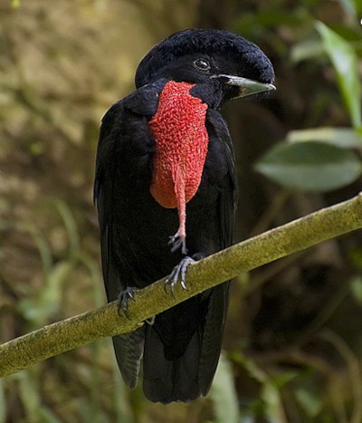

# Summary as of Wednesday 27 July 2022 

# Sprint 114

## Just Done
* TEXT_HERE
* TEXT_HERE
* TEXT_HERE

## About to Do/Doing
* TEXT_HERE
* TEXT_HERE
* TEXT_HERE

## Bugs Fixed this week
The following bugs were fixed this week.
[Bug Fixes week to Wednesday 27 July 2022](graphs/bugs27072022.png)

We planned the following issues in this sprint 
[Sprint 114](graphs/sprint27072022.png)

## Support tickets and known issues
[Link to Support Board](https://collaboration.homeoffice.gov.uk/jira/secure/RapidBoard.jspa?rapidView=1717&selectedIssue=ASSB-253)

[Support board - cached](graphs/supportBoard27072022.png)

## Click here for metrics / progress against plan
[Sprint 114](graphs/progress27072022.png)

[Post Release Roadmap](graphs/roadmap27072022.png)

### We decided to focus on the following areas in this sprint
1. Release refuse a PPL 
2. Design specifications for reusable steps 
3. HOCS Audit

## Sample Design Prototypes

 

 

## Google Analytics for this report
[Google Analytics](graphs/GA27072022.png)

