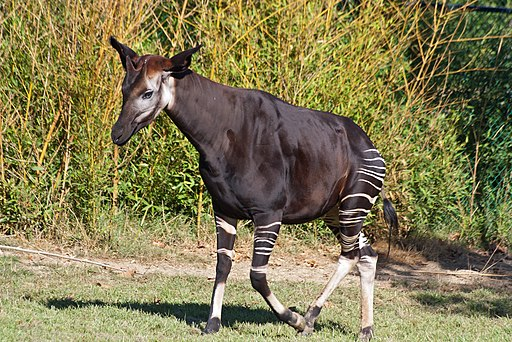

# Summary as of Wednesday 27th August 2025

## Future research and recruitment 

Thank you for your continued involvement in user research for ASPeL– your participation is integral to understanding the user experience. The research on ASPeL features continues. Please contact our user researcher David.utley@digital.homeoffice.gov.uk to participate. Thank you.  
 
# Sprint: 160(Okapi)

Attribution:

# Completed this Sprint
We completed 7 issues this Sprint as listed below:
1) We re-arranged the sequence of options for animals re-used and reworded the questions for clarity.
2) We added the inspector view to the NVS, NACWO and other users' Named persons' application.
3) We also inserted the 'mandatory training' which was missing in the inspectors' view on NACWO and NVS Named Persons' applications and nominations.
4) We added a declaration statement on the Named Person's journey to the inspectors' screen.
5) We added an additional column for PPL numbers to the establishment RoPs details page for clarity.
6) We added a new warning to inspectors on overdue RoPs when PPLs are transferred
7) We completed the REACT upgrade to improve ASPeL
8) We completed the improvements to the Named Persons' nominations journey and started user testing.
   

	
 

    

# Bugs Done or Closed this Sprint

 

# New Sprint 161 (Pangolin)

Attribution:

Interesting fact about Pangolins: They are mostly found in Africa and Asia. They have muscular probing tongues to forage for their favourite food, ants. They can deploy a harsh odour to ward off predators.

# Planned for this Sprint 161(Pangolin)
WE will;

1)Conclude ongoing user testing on completed Named Persons' applications, nominations and journey.
2)Collate feedback from ongoing user testing.
3)Complete security assessment report. 
4)Produce first draft of Technical Roadmap 2 and To Do List.
5)Cat E PILs: finish confluence and refine tickets, whilst awaiting confirmation on fees structure from ASRU.
6)Standard protocols: start confluence and update prototype ready for ticket writing.
7)Get ASRU sign-off on the new standard protocols and  send out to a wider group for review.
8)Named person: get 3 new named person guides signed off and write new declaration tickets.
  
   
   

   

## Things to bear in mind
Kindly let us know how we are doing in keeping you informed. We appreciate your feedback on the content of this report. 

