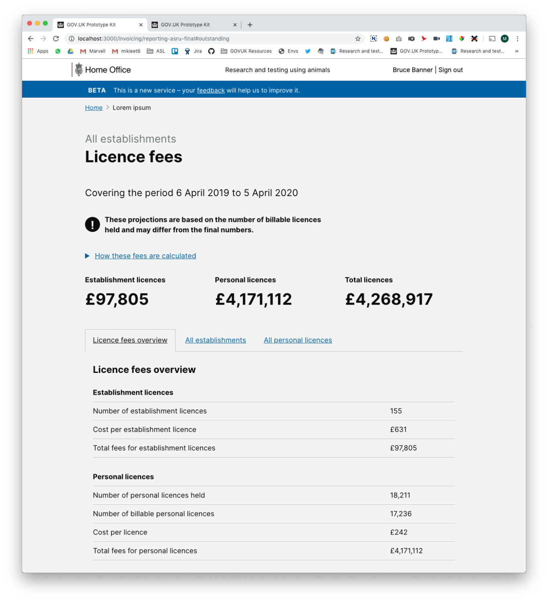
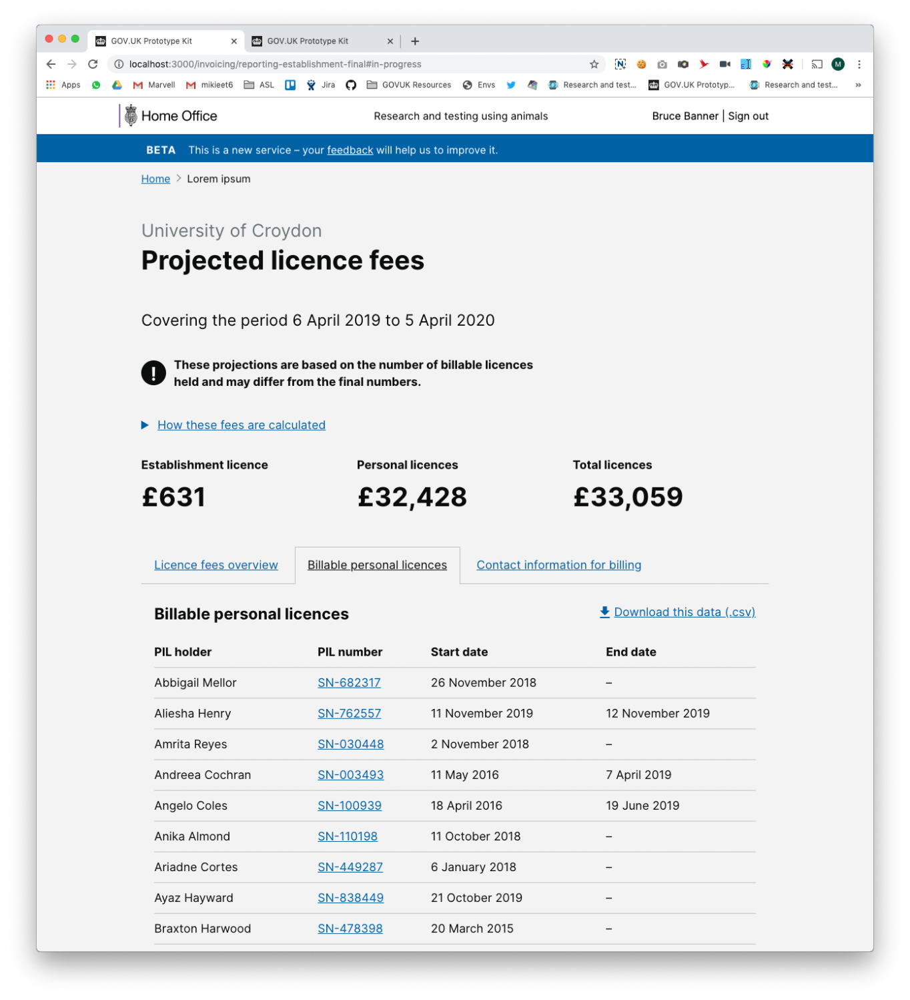

# Summary as of Wednesday 27 November 2019 

# Sprint 47

## Just Done
* TEXT_HERE
* TEXT_HERE
* TEXT_HERE

## About to Do/Doing
* TEXT_HERE
* TEXT_HERE
* TEXT_HERE

## Bugs Fixed this week
The following bugs were fixed this week.
[Bug Fixes week to Wednesday 27 November 2019](graphs/bugs27112019.png)

We planned the following issues in this sprint 
[Sprint 47](graphs/sprint27112019.png)

## Support tickets and known issues
[Link to Support Board](https://jira.digital.homeoffice.gov.uk/secure/RapidBoard.jspa?rapidView=331&selectedIssue=ALS-47)

[Support board - cached](graphs/supportBoard27112019.jpg)

## Click here for metrics / progress against plan
[Sprint 47](graphs/progress27112019.png)

[Post Release Roadmap](graphs/roadmap27112019.png)

Our goals for the current sprint are:
1. TEXT_HERE 
2. TEXT_HERE
3. TEXT_HERE

## Sample Design Prototypes

 

 

## Google Analytics for this report
[Google Analytics](graphs/GA27112019.png)

