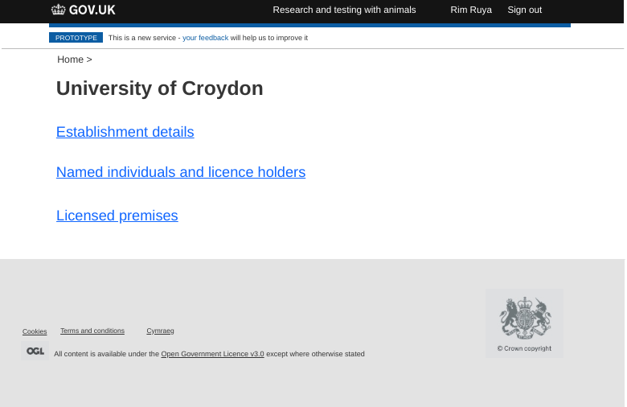
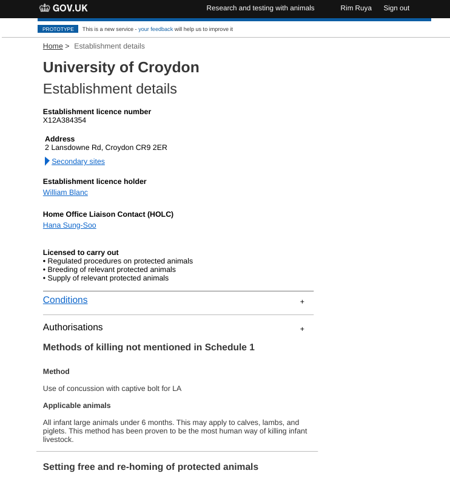

# Summary as of 28th March 2018 
## What's Blocking us / Issues
* We are still waiting for security clearance for two members of the team. This is still making arranging meetings in Lunar house difficult for some members of the team.

## Just Done
* Conducted user testing with 10 HOLCS at the HOLTIF meeting at 2MS
* Developed working prototypes of filtering of schedule of premises
* Built a build monitor to aid ongoing code development 

## About to Do/Doing
* Analysis of findings from user testing
* Modifications to design prototypes in light of findings from user testing
* Develop download to  PDF of sorted and filtered establishment data

## Things to be aware of
* The team has two new members - an interaction designer and a software developer

## Click here for our High-Level Road map
[Link to Live Road map in Trello](https://trello.com/b/gDQdE01u/asl-roadmap)    [\(Cached Image\)](graphs/ASLRoadMap28032018.jpg)

## Click here for metrics / progress against plan
[Week 2 - Sprint 4 - Release 1](graphs/progress28032018.jpg)

## Risks
[Links to Project Risks in Trello](https://trello.com/b/VuFuCL7t/risk-register-and-kpis-asl-delivery)    [\(Cached Image\)](graphs/ASLRiskRegister28032018.jpg)

[Risk Management Chart](graphs/risk28032018.jpg)

## Sprint Planning
* We planned the following issues in sprint planning today [Link to Issues in Jira](https://jira.digital.homeoffice.gov.uk/secure/RapidBoard.jspa?rapidView=261)    [\(Cached Image\)](graphs/sprint28032018.jpg)
Our three goals for the sprint are
* Explore Establishment Licence Details
* Validate Changes to the Prototype as a Result of Research Findings
* PDFs of sorted and filtered establishment data

## Design Prototypes
[Establishment Home](graphs/EstablishmentHome.png)

[Establishment Details Showing Authorisations](graphs/EstablishmentAndAuthorisations.png)

## Working Software Prototypes
* Log in to this [technical prototype](https://public-ui.notprod.asl.homeoffice.gov.uk/places) with username "holc" and password "holc" which shows filtering of the schedule of premises for the fictional University of Croydon.

