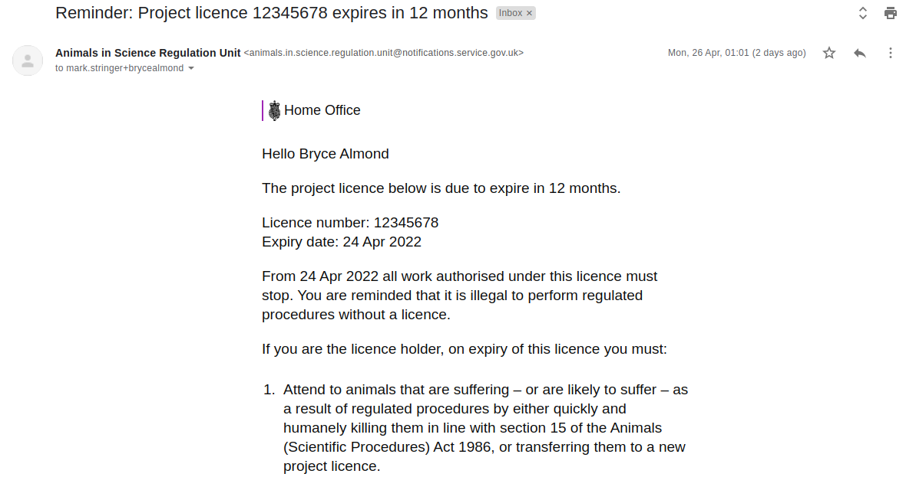

# Summary as of Wednesday 28 April 2021 

# Sprint 83 (Pterodactyl)

## Weekly summary
Email alerting for PPL expiry (at 12, 6, 3 and 0 months) went live this week. The team also continued to address issues arising from early use of inputting of RoPs.

## Just Done
* TEXT_HERE
* TEXT_HERE
* TEXT_HERE

## About to Do/Doing
* TEXT_HERE
* TEXT_HERE
* TEXT_HERE

## Bugs Fixed this week
The following bugs were fixed this week.
[Bug Fixes week to Wednesday 28 April 2021](graphs/bugs28042021.png)

We planned the following issues in this sprint 
[Sprint 83](graphs/sprint28042021.png)

## Support tickets and known issues
[Link to Support Board](https://collaboration.homeoffice.gov.uk/jira/secure/RapidBoard.jspa?rapidView=1717&selectedIssue=ASSB-253)

[Support board - cached](graphs/supportBoard28042021.png)

## Click here for metrics / progress against plan
[Sprint 83](graphs/progress28042021.png)

[Post Release Roadmap](graphs/roadmap28042021.png)

### We planned this goal for the current sprint 83 (pterodactyl)
Initial release of changes to ASRU workflow - assignment of tasks, inspectors can grant licences (working software)

### We planned this goal for the last sprint 82 (Ocelot)
Send expiry notifications for PPLs (working software) ***[Done]***

## Screenshot of recently developed software
### An email alert for an expiring PPL

 

## Google Analytics for this report
[Google Analytics](graphs/GA28042021.png)

