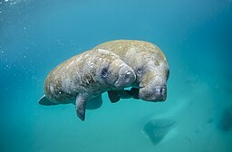

# Summary as of Wednesday 28th June 2023

## New Features

**Named Person journey**

We are still recruiting for our research sessions on the Named Person journey, we welcome users of a variety of experience. A big 'thank you' to all who have particiapted already in one of our reseearch sessions!

Don't forget to check out our [roadmap](https://roadmap.prodpad.com/937455be-8d08-11ed-aa53-2a7db0eb1d9c) to see what's coming next to ASPeL.

# Completed Sprint: 132 (Manatee)

## Completed in Sprint 132 (Manatee)
*Reviewed content for named person applications
*Updated the prototype for last research participant session
*Prepared and added research finding to the PIL E new features
*Reviewed PIL-E journey content with developers in preparation for development
  
 
## Bugs Fixed this Sprint
The following bugs were fixed in this sprint.
[Bug Fixes week to Wednesday 28th June 2023](graphs/bug28062023.png)

# New Sprint: 133 (Numbat)

![Martin Pot (Martybugs at en.wikipedia), CC BY 3.0 <https://creativecommons.org/licenses/by/3.0>, via Wikimedia Commons(graphs/numbat.jpg)

## Planned for Sprint 133 (Numbat)
1) Implement the PIL E Design based on information received form research participants
2) Complete preparation for Named Person research.
3) Find a fix for the deployment issues that have been affecting the testing environment.
4) Review handover from Marvel team on Named Person and start an implementation plan.
   

## Things to bear in mind
Let us know how we are doing in keeping you informed. We appreciate your feedback on the content of this report.

The numbat is a small, distinctively-striped animal between 35 and 45 centimetres (14 and 18 in) long, including the tail, with a finely pointed muzzle and a prominent, bushy tail about the same length as its body

# Work in progress

## Support tickets and known issues
[Link to Support Board](https://collaboration.homeoffice.gov.uk/jira/secure/RapidBoard.jspa?rapidView=1717)

## Roadmap

[Link to our new Roadmap](https://roadmap.prodpad.com/937455be-8d08-11ed-aa53-2a7db0eb1d9c)
