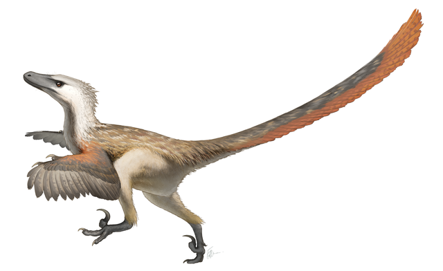
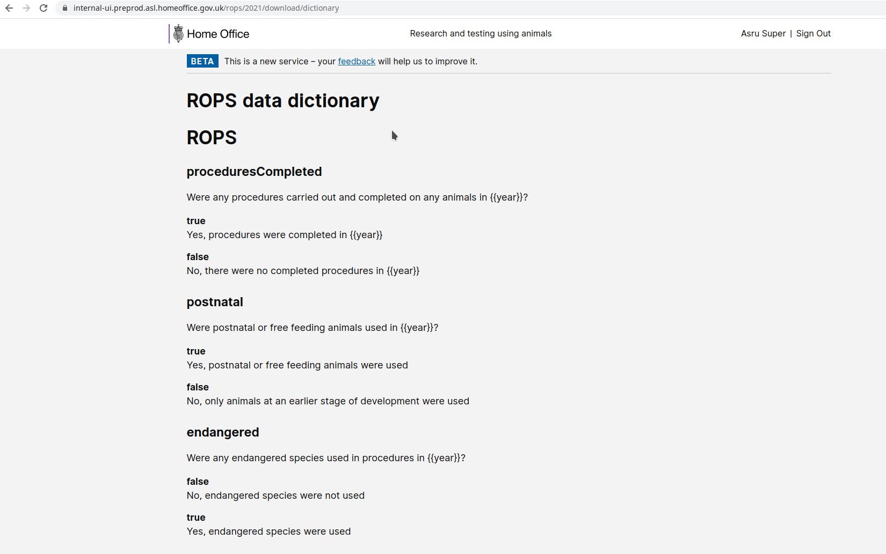

# Summary as of Wednesday 28 July 2021

# Sprint 89 (Velociraptor)

## Weekly summary
Our long term product manager is leaving the team after over three years of amazing service. The team continued to address issues arising from the rollout of ROPs. The design team also completed a pilot test of reusable steps designs with inspectors.

## Just Done
* Pilot test of reusable steps with inspectors with minor tweaks to designs (design team)
* Added “glossary of terms” content to ROPs export page to assist in understanding the raw data (working software)
* Updated logic to display of “My tasks” list on ASRU dashboard so all ASRU users see their assigned tasks (working software)
* Improved typography in Word exports of PPL applications (working software)
* Assorted bug fixes (working software)

## About to Do/Doing
* Improvements to RoPs navigation and new filtering for task lists (design team)
* Add functionality to include multiple “other” purposes and sub-purposes within a single ROP (working software)
* Consolidated establishment level ROPs data download (working software)
* Assorted bug fixes (working software)

## Bugs Fixed this week
The following bugs were fixed this week.
[Bug Fixes week to Wednesday 28 July 2021](graphs/bugs28072021.png)

We planned the following issues in this sprint 
[Sprint 89](graphs/sprint28072021.png)

## Support tickets and known issues
[Link to Support Board](https://collaboration.homeoffice.gov.uk/jira/secure/RapidBoard.jspa?rapidView=1717&selectedIssue=ASSB-253)

[Support board - cached](graphs/supportBoard28072021.png)

## Click here for metrics / progress against plan
[Sprint 89](graphs/progress28072021.png)

## Release roadmap
The roadmap is currently being reviewed

## We set the following goals for this sprint (Velociraptor)
1. Address all known Return of procedures issues 
2. Test reusable steps components with inspectors (user research) 
3. Design option for improving task views for ASRU (design)

## Sample Design Prototypes
### ROPs data dictionary 

 

## Google Analytics for this report
[Google Analytics](graphs/GA28072021.png)

