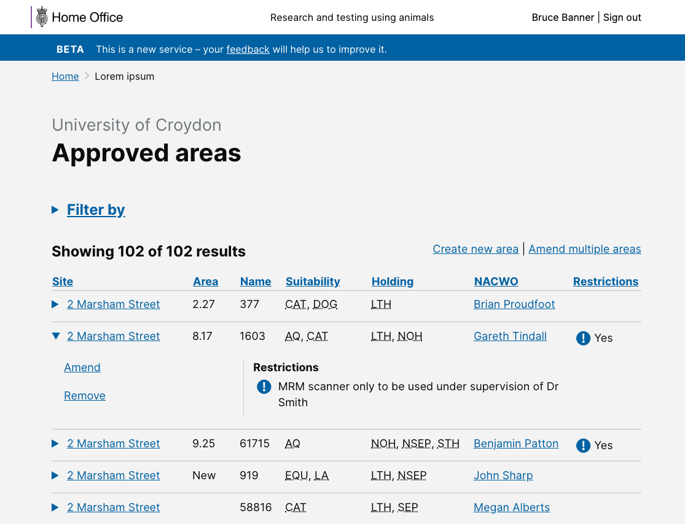
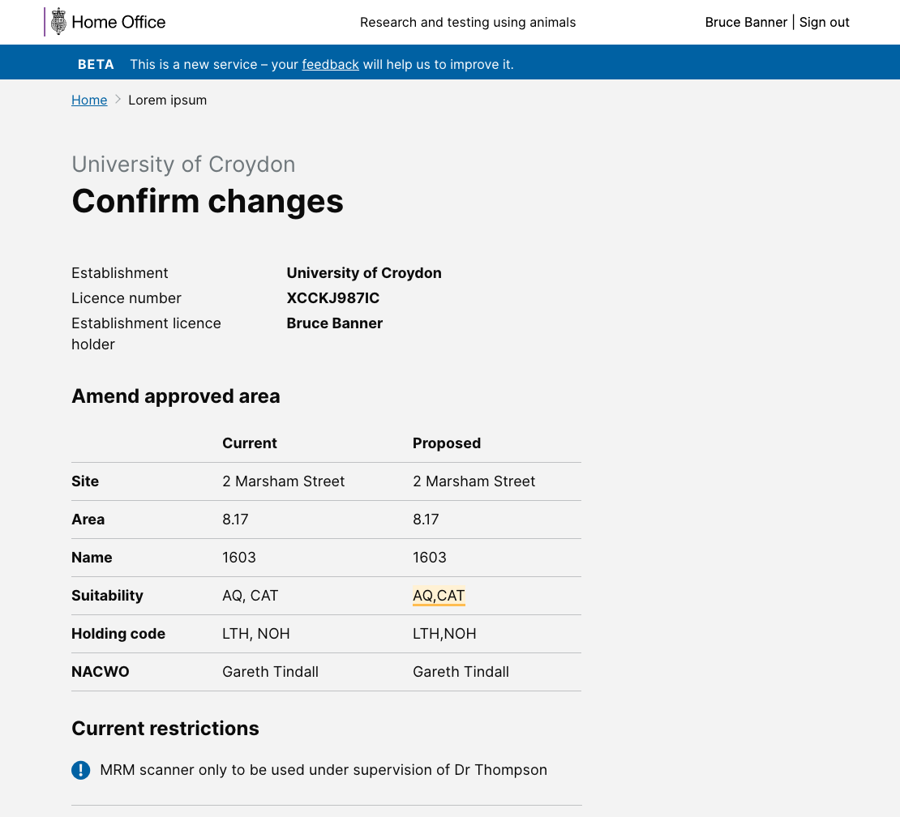

# Summary as of 28st August 2019 

# Sprint 40

## Just Done
* Improvements to word document download

## About to Do/Doing
* PPL Revocation
* Editing and resubmitting of tasks
* Improving withdrawal of tasks

## Things to be aware of
* Rollout to all establishments has completed

## Bugs Fixed this week
The following bugs were fixed this week.

[Bug Fixes to week ending 28th August 2019](graphs/bugs28082019.jpg)

## Support tickets and known issues
[Link to Support Board](https://jira.digital.homeoffice.gov.uk/secure/RapidBoard.jspa?rapidView=331&selectedIssue=ALS-47)

[Support Board Status - cached](graphs/supportBoard28082019.jpg)

## Click here for metrics / progress against plan
[Week 2 - Sprint 39 - Release 1](graphs/progress28082019.png)

[We planned these issues in this sprint](graphs/sprint28082019.png)

## Our goals for the sprint are:
1. Edit and resubmit tasks 
2. Complete roll-out to establishments 
3. Support internal and external users

## Sample Design Prototypes

 

 

## Google Analytics for this report
[Google Analytics](graphs/GA28082019.jpg)

