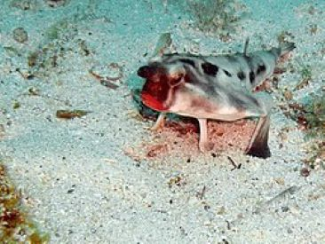
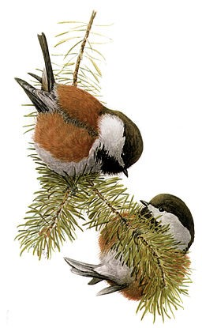

# Summary as of Wednesday 28th August 2024

## Future research and recruitment 

Thank you for your continued involvement in user research – your participation is integral to understanding the user experience on ASPeL. The research on the Named Persons journey continues. Please contact our user researcher rachel.cholerton@digital.homeoffice.gov.uk to participate. thank you.  
 

Please note that the link to the Roadmap is no longer available here.

Completed Sprint 147 (Red-lipped BatFish)

Attribution:

Fun facts about Red-lipped Batfish - native to the Galapagos Islands and Peru, noted for its bright red lips and inability to swim.

# Completed this Sprint: 147 (Red-lipped BatFish)
1) Keeping animals alive - new options and updates for establishments choosing to keep animals alive after use in procedures.
2) Usability test for Named People playback
3) We updated the security certificate used for communication between the application and the database to the latest version.
4) We identified and designed the minimum viable product (MVP) for the Named People work in readiness for development.

   

# Bugs Fixed this Sprint 
Bug Fixes week to Wednesday 28 August 2024(graphs/Bugs Done or Closed280824.jpg)

## Future research and recruitment 

Thank you for your continued involvement in user research – your participation is integral to understanding the user experience on ASPeL. The research on the Named Persons journey continues. Please contact our user researcher rachel.cholerton@digital.homeoffice.gov.uk to participate. thank you.  
 

Please note that the link to the Roadmap is no longer available here.

Completed Sprint 147 (Red-lipped BatFish)

Attribution:

Fun facts about Red-lipped Batfish - native to the Galapagos Islands and Peru, noted for its bright red lips and inability to swim.

# Completed this Sprint: 147 (Red-lipped BatFish)
1) Keeping animals alive - new options and updates for establishments choosing to keep animals alive after use in procedures.
2) Usability test for Named People playback
3) We updated the security certificate used for communication between the application and the database to the latest version.
4) We identified and designed the minimum viable product (MVP) for the Named People work in readiness for development.

   

# Bugs Fixed this Sprint 
[Bug Fixes week to Wednesday 31 July 2024](# Summary as of Wednesday 28th August 2024

## Future research and recruitment 

Thank you for your continued involvement in user research – your participation is integral to understanding the user experience on ASPeL. The research on the Named Persons journey continues. Please contact our user researcher rachel.cholerton@digital.homeoffice.gov.uk to participate. thank you.  
 

Please note that the link to the Roadmap is no longer available here.

Completed Sprint 147 (Red-lipped BatFish)

Attribution:

Fun facts about Red-lipped Batfish - native to the Galapagos Islands and Peru, noted for its bright red lips and inability to swim.

# Completed this Sprint: 147 (Red-lipped BatFish)
1) Keeping animals alive - new options and updates for establishments choosing to keep animals alive after use in procedures.
2) Usability test for Named People playback
3) We updated the security certificate used for communication between the application and the database to the latest version.
4) We identified and designed the minimum viable product (MVP) for the Named People work in readiness for development.

   

# Bugs Fixed this Sprint 
[Bug Fixes week to Wednesday 28 August 2024]

# New Sprint: 148(Chickadee)

Attribution:

Fun facts about Chickadee - Chestnut-backed chickadees mate monogamously, and can stay with the same partner for years.

## Planned for Sprint 148 (Chickadee)

1) 

   

## Things to bear in mind
Kindly let us know how we are doing in keeping you informed. We appreciate your feedback on the content of this report.

# Work in progress
1) Improvements to the user experience in ASPeL, when selecting options for the fate of animals being kept alive after they have been used in procedures.
  

   
 
   
## Support tickets and known issues
[Link to Support Board](https://collaboration.homeoffice.gov.uk/jira/secure/RapidBoard.jspa?rapidView=1717))

# New Sprint: 148(Chickadee)

Attribution:

Fun facts about Chickadee - Chestnut-backed chickadees mate monogamously, and can stay with the same partner for years.

## Planned for Sprint 148 (Chickadee)

1) 

   

## Things to bear in mind
Kindly let us know how we are doing in keeping you informed. We appreciate your feedback on the content of this report.

# Work in progress
1) Improvements to the user experience in ASPeL, when selecting options for the fate of animals being kept alive after they have been used in procedures.
  

   
 
   
## Support tickets and known issues
[Link to Support Board](https://collaboration.homeoffice.gov.uk/jira/secure/RapidBoard.jspa?rapidView=1717)

# New Sprint: 148(Chickadee)

Attribution:

Fun facts about Chickadee - Chestnut-backed chickadees mate monogamously, and can stay with the same partner for years.

## Planned for Sprint 148 (Chickadee)

1) 

   

## Things to bear in mind
Kindly let us know how we are doing in keeping you informed. We appreciate your feedback on the content of this report.

# Work in progress
1) Improvements to the user experience in ASPeL, when selecting options for the fate of animals being kept alive after they have been used in procedures.
  

   
 
   
## Support tickets and known issues
[Link to Support Board](https://collaboration.homeoffice.gov.uk/jira/secure/RapidBoard.jspa?rapidView=1717)
