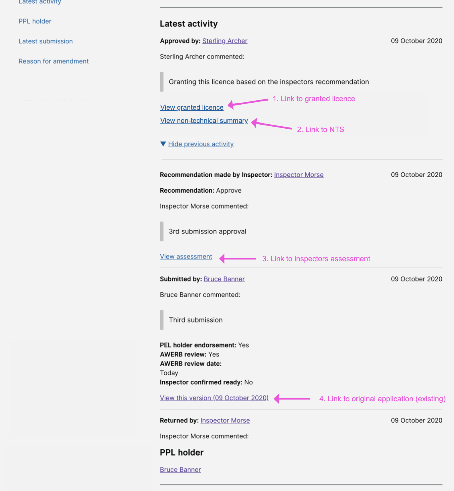

# Summary as of Wednesday 28 October 2020 

# Sprint 70 &#x1F965;

## Just Done
* Summarised research findings for RoPs (Returns of Procedures) - user research 
* Updated digital consent form digitised by HO Research Operations - user research
* Scheduled a RoPs session with two inspectors - user research
* Scheduled RoPs testing sessions with HOLCs and PPL holders from four establishments - user research
* Designs for linking to granted documents from PPL tasks' activity history - design 
* Refining assessment sections and navigation following user feedback - content design
* Various improvements to microcopy - content design
* Added search to schedule of premises - working software
* Initial data schema design and implementation for PPL additional availability - working software

## About to Do/Doing
* Planning a session with one more establishment - user research
* Preparing for the RoPs testing - user research
* Designs and prototyping for the new RoPs journey - design
* Content for Returns of procedures prototype - content design
* Improve visibility of user declarations on licence applications - working software
* Make improvements to performance metrics dashboard - working software

## Bugs Fixed this week
The following bugs were fixed this week.
[Bug Fixes week to Wednesday 28 October 2020](graphs/bugs28102020.png)

We planned the following issues in this sprint 
[Sprint 70](graphs/sprint28102020.png)

## Support tickets and known issues
[Link to Support Board](https://collaboration.homeoffice.gov.uk/jira/secure/RapidBoard.jspa?rapidView=1717&selectedIssue=ASSB-253)

[Support board - cached](graphs/supportBoard28102020.png)

## Click here for metrics / progress against plan
[Sprint 70](graphs/progress28102020.png)

[Post Release Roadmap](graphs/roadmap28102020.png)

### These are the goals for this sprint (sprint name - Coconut) &#x1F965;
1. Prepare for testing the Returns of Procedures prototype and high-level user journey -  user research and design
2. Additional availability release candidate - development (sprint name - Coconut)

### These were the goals for the previous sprint
1. Release category E PILs - working software ***[Done]***
2. PPL version control - design and content ***[In progress]***
3. Summary of findings for returns of procedures - user research ***[Done]***

## Sample Design Prototypes
### ASRU View - Designs for linking to granted documents from PPL tasks' activity history

 

## Google Analytics for this report
[Google Analytics](graphs/GA28102020.png)

