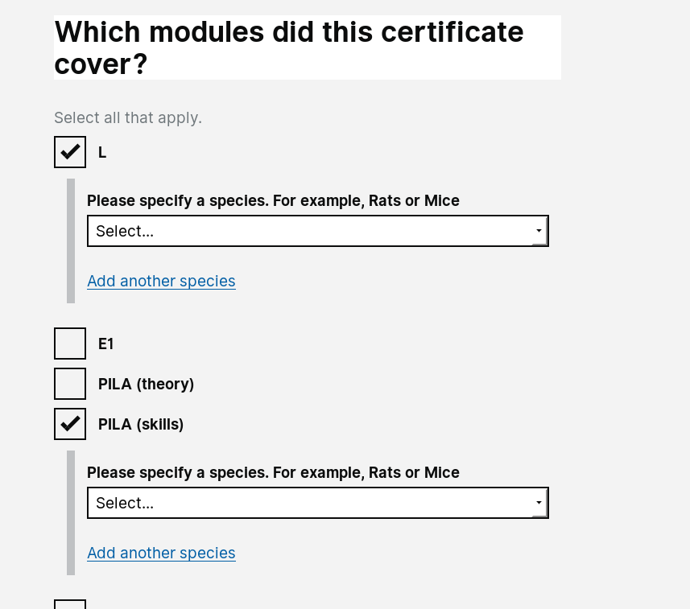

# Summary as of 28th November 2018 

## Just Done
* Completed Designs for PPL application - Project Plan and Non-Technical Summary
* Completed User Research design for testing to be carried out at LASA conference
* Further User Research with Inspectors and Establishment Users and other interested parties - PPL application
* Invited 30 HOLCs to The University of Croydon
* Presented an update to 50 HOLCs at the HOLTIF meeting and the ASRU conference
* Working software - focus on improvement of flow for external user invitation 

## About to Do/Doing
* Further iterations of designs for project plan and non-technicial summary
* Development for working software for PPL front-end prototype
* Sharing of User Research findings from previous sprint

## Things to be aware of
* We have passed our second Alpha service assessment

## Click here for our High-Level Road map
[Link to Live Road map in Trello](https://trello.com/b/gDQdE01u/asl-roadmap)    [\(Cached Image\)](graphs/ASLRoadMap28112018.jpg)

## Click here for metrics / progress against plan
[Week 1 - Sprint 22 - Release 1](graphs/progress28112018.png)

## Burnup Chart

[Burnup Chart](burnup28112018.md)

## Risks
[Links to Project Risks in Trello](https://trello.com/b/VuFuCL7t/risk-register-and-kpis-asl-delivery)    [\(Cached Image\)](graphs/ASLRiskRegister28112018.jpg)

[Risk Management Chart](graphs/risk28112018.png)

## Sprint Planning
* We planned the following issues in sprint planning today [Link to Issues in Jira](https://jira.digital.homeoffice.gov.uk/secure/RapidBoard.jspa?rapidView=261)    [\(Cached Image\)](graphs/sprint28112018.png)

### Our goals for the previous sprint were:
 
1. Design - project plan for PPL \[***Completed***\]
2. UR - validate designs at LASA and ASRU conferences \[***Completed***\] 
3. DEV - focus on external user onboarding \[***Completed***\]

### Our goals for the sprint are:
1. Content Design - Full PPL Research Application 
2. UR - Playback findings from LASA and ASRU 
3. Build PPL Prototype

## "University of Croydon" Test Environment 

### Screenshots

 
 

### Need a test account?
If you need a test account please contact [animalscience@digital.homeoffice.gov.uk](animalscience@digital.homeoffice.gov.uk) 
