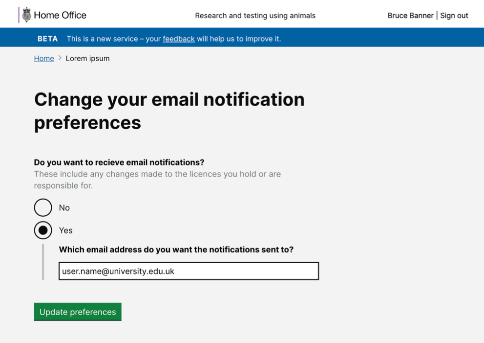

# Summary as of Wednesday 29 January 2020 

# Sprint 50

## Just Done
* ASRU can now initiate a PIL transfer on behalf of a user (providing the user is associated with multiple establishments)
* ASRU Admin can discard any open task at any time

## About to Do/Doing
* Improved licence headers - similar style for different licence types - working software
* TEXT_HERE
* TEXT_HERE

## Bugs Fixed this week
The following bugs were fixed this week.
[Bug Fixes week to Wednesday 29 January 2020](graphs/bugs29012020.png)

We planned the following issues in this sprint 
[Sprint 50](graphs/sprint29012020.png)

## Support tickets and known issues
[Link to Support Board](https://collaboration.homeoffice.gov.uk/jira/secure/RapidBoard.jspa?rapidView=1717&selectedIssue=ASSB-253)

[Support board - cached](graphs/supportBoard29012020.png)

## Click here for metrics / progress against plan
[Sprint 50](graphs/progress29012020.png)

[Post Release Roadmap](graphs/roadmap29012020.png)

Our goals for the current sprint are:
1. Dev and Design - improve PPL downloads 
2. UR - engage with inspectorate 
3. Content - gov.uk updates

## Sample Design Prototypes

 

 

## Google Analytics for this report
[Google Analytics](graphs/GA29012020.png)

