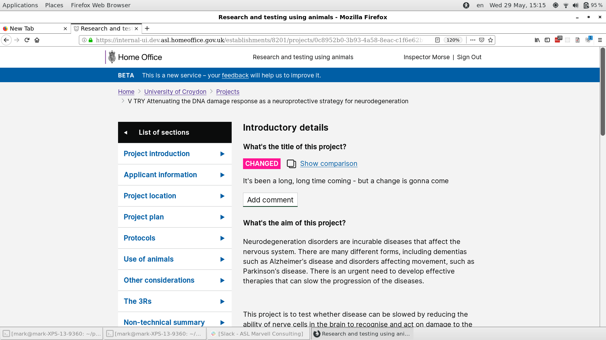
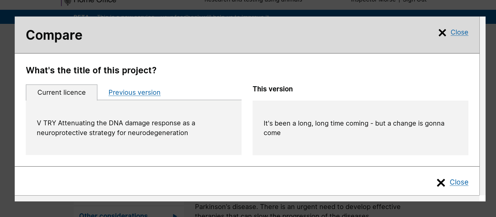

# Summary as of 29th May 2019 

# Sprint 34

## Just Done
* Comparison of versions for PPL application
* Testing of Non-UGC content with users at ASRU conference
* Design of digital and print view of granted PPL licences

## About to Do/Doing
* Continuing testing of "Halloween" data with establishment users
* Working software - conditions and authorisations for PILs and PELs
* Design of digital and print views of legacy PPLs

## Things to be aware of
* IT Healthcheck testing is continuing.

## Click here for Prioritised Road Map
[Prioritised Road Map](graphs/ASLRoadMap29052019.jpg)

## Click here for metrics / progress against plan
[Week 1 - Sprint 39 - Release 1](graphs/progress29052019.png)

## Burnup Chart
[Burnup Chart](burnup29052019.md)

## Risks
[Links to Project Risks in Trello](https://trello.com/b/VuFuCL7t/risk-register-and-kpis-asl-delivery) 
[Link to Risk Chart](graphs/risk29052019.png)

## Sprint Planning
* We planned the following issues in sprint planning today [Link to Issues in Jira](https://jira.digital.homeoffice.gov.uk/secure/RapidBoard.jspa?rapidView=261)    [\(Cached Image\)](graphs/sprint29052019.png)

Our goals for the previous sprint were:
1. Test views of granted PPL **[Done]**
2. Test Non-UGC at ASRU conference **[Done]**
3. Working software PIL amendments **[Done]**
4. Design PIL and PEL conditions and authorisations **[In Progress]**
5. Design views of granted licence **[Done]**

Our goals for the sprint are:
1. Halloween data testing 
2. End to end test ASRU/Establishments 
3. Dev Conditions and authorisations for PILs and PELs 
4. PEL Details amendments 
5. Design views of granted PPLs (including legacy)

## Screenshots

 

 

## Google Analytics for this report
[Google Analytics](graphs/GA29052019.jpg)

