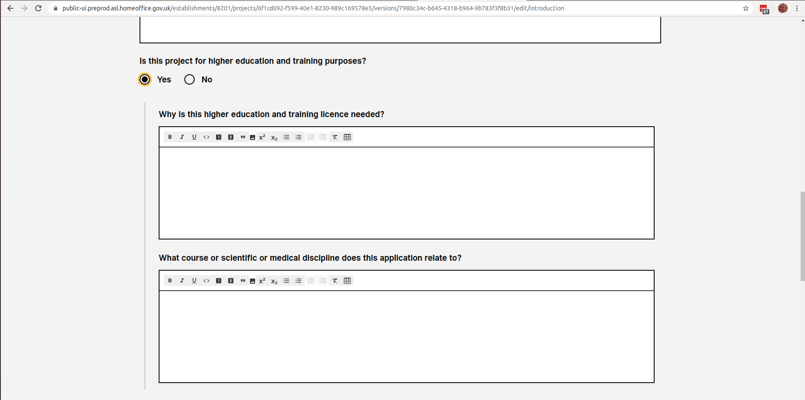
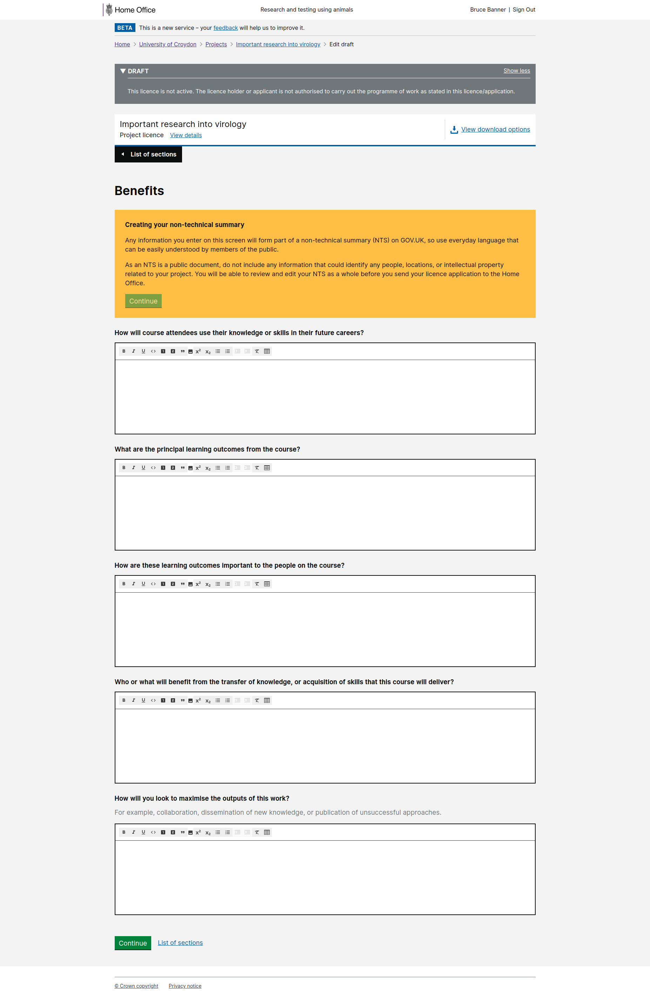

# Summary as of Wednesday 29 July 2020 

# Sprint 63

## Just Done
* Summarised findings from testing the RA user journey with establishments and ASRU - user research
* Presented the findings to the team - user research
* Recruited two establishments for testing the new RA designs - user research
* Prototyping the new 'submitting a retrospective assessment' journey - design
* Implemented changes to statutory deadlines content following research - content design
* Training and Education PPLS - working software
* RA indicators in project lists - working software
* Investigation into name aliasing in people search - working software

## About to Do/Doing
* Recruiting two more establishments - user research
* Planning the discussion guide for the sessions - user research
* Improvements to the search interface following on from elastic search - design
* First draft of content for users submitting a retrospective assessment - content design
* Rebuild of training certificate interfaces - working software
* Category E PILs - working software
* Make success messaging more consistent - working software

## Things to bear in mind

The work the research and design team begun on PPL assessments for inspectors earlier this year, was put on hold until the research and design work for the following had been completed:

* Education and training PPLs
* Category E PILs
* Secondary availability on PPLs
* PPL holder training

This work has now been designed and tested, and has now been delivered (in the case of E&T PPLs) or is being built.

The research and design team is currently working on retrospective assessments, after which they will be returning to the PPL assessment work.

## Bugs Fixed this week
The following bugs were fixed this week.
[Bug Fixes week to Wednesday 29 July 2020](graphs/bugs29072020.png)

We planned the following issues in this sprint 
[Sprint 63](graphs/sprint29072020.png)

## Support tickets and known issues
[Link to Support Board](https://collaboration.homeoffice.gov.uk/jira/secure/RapidBoard.jspa?rapidView=1717&selectedIssue=ASSB-253)

[Support board - cached](graphs/supportBoard29072020.png)

## Click here for metrics / progress against plan
[Sprint 63](graphs/progress29072020.png)

[Post Release Roadmap](graphs/roadmap29072020.png)

## These are the goals for the current sprint:

1. Design and Content - Prototype for submission of a retrospective assessment 
2. Working Software - Training profiles 
3. User Research - complete prototype testing for RA submission

## These were the goals for the previous sprint:

1. User needs research for retrospective assessments 
2. Design and content - improvements to the performance metrics page 
3. Working software - change password

## Sample Design Prototypes

### Screenshots from new Training and Education PPL application

 

 

## Google Analytics for this report
[Google Analytics](graphs/GA29072020.png)

