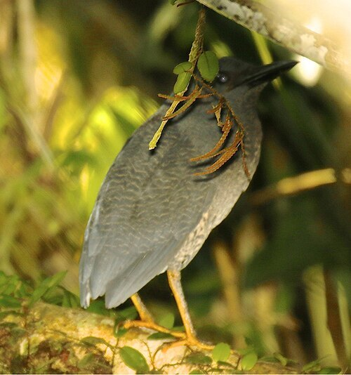
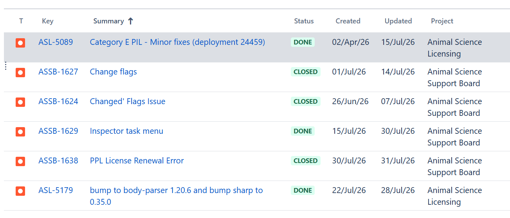

# Summary as of Wednesday 29th July 2026

## Future research and recruitment 

Thank you for your continued involvement in user research for ASPeL– your participation is integral to understanding the user experience. The research on ASPeL features continues. Please contact kathy.warburton@homeoffice.gov.uk to participate. Thank you.  
 
# Completed Sprint 171(zig-zag heron)

Attribution:

Interesting facts about zigzag herons: these birds have a peculiar habit of tail flicking when hunting.

# Completed this Sprint: 171(zig-zag heron)

1) A review of the backlog of tech debt was done to ensure proper maintenance of ASPeL.
2) We investigated how PIL-Es work in preparation for continuation of the work.

# Bugs done or closed this Sprint

# New Sprint 172(Aardwolf)

Attribution:

Interesting facts about aardwolf: They live in one or two dens at a time and rotate these every six months.

# Our goals for Sprint 172(aardwolf)

1)Progress the standard protocol Proof of Concept for Standard Protocol4
2)Complete the NTS DOCX. bulk download and demonstrate to ASRU
3)Complete all remaining Named Person work to achieve 100% completion
4)Complete required improvements to actions-tasks-metrics in ASPeL to support the business performance management work.
5)Create functionality to measure any improvements in standard protocols work post deployment of the minimum viable product.
6)Complete all outstanding comments display issues, currently being tested.

## Things to bear in mind
Kindly let us know how we are doing in keeping you informed. We appreciate your feedback on the content of this report. Thank you.

