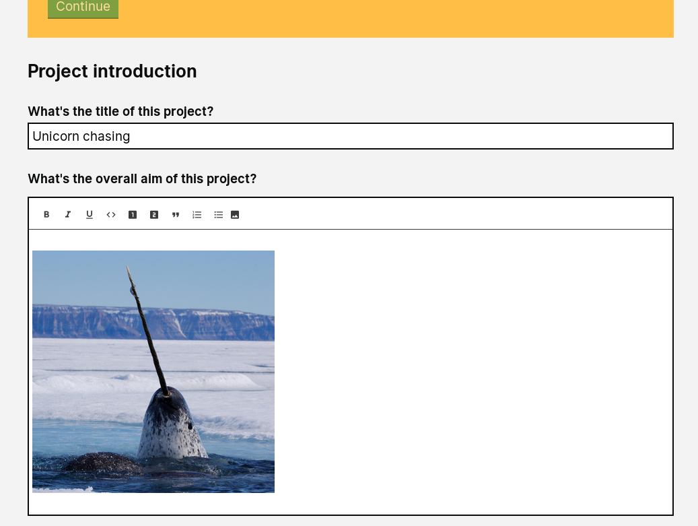

# Summary as of 30th January 2019 

# Sprint 25 - Mid-Sprint

## Just Done
* RRRTEXT_FILL

## About to Do/Doing
* RRRTEXT_FILL

## Things to be aware of
* RRRTEXT_FILL

## Click here for Prioritised Road Map
[Prioritised Road Map](https://trello.com/b/p7x9hbPV/prioritised-roadmap)    [\(Cached Image\)](graphs/ASLRoadMap30012019.jpg)

## Click here for metrics / progress against plan
[Week 2 - Sprint 25 - Release 1](graphs/progress30012019.png)

## Burnup Chart

[Burnup Chart](burnup30012019.md)

## Risks
[Links to Project Risks in Trello](https://trello.com/b/VuFuCL7t/risk-register-and-kpis-asl-delivery) 

[Risk Management Chart](risk30012019.png)

## Sprint Planning
* We planned the following issues in sprint planning today [Link to Issues in Jira](https://jira.digital.homeoffice.gov.uk/secure/RapidBoard.jspa?rapidView=261)    [\(Cached Image\)](graphs/sprint30012019.png)

Our goals for the sprint are:
1. Release Draft Tool PPL
2. PPL Review & agree with team and PO
3. Designs for test with inspectors PPL app review
4. PPL Document Export
5. Review and approval screen for all tasks that are representable

## Screenshots of the PPL application prototype

 
 

## Google Analytics for this report

This shows:
* total number of users
* number of new users

[Google Analytics](graphs/GA30012019.jpg)

