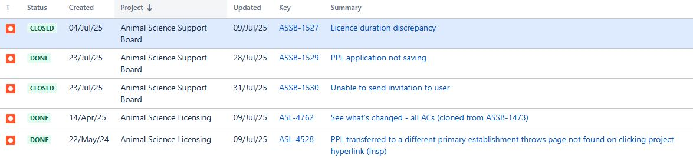
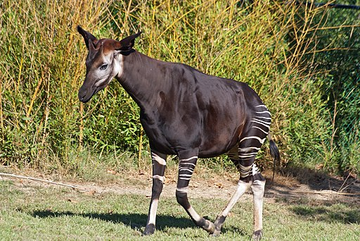

# Summary as of Wednesday 30th July 2025

## Future research and recruitment 

Thank you for your continued involvement in user research for ASPeL– your participation is integral to understanding the user experience. The research on ASPeL features continues. Please contact our user researcher David.utley@digital.homeoffice.gov.uk to participate. Thank you.  
 
# Sprint: 159(Nudibranch aka sea slug)

attribution:

# Completed this Sprint
We completed the following:
1) Further improvements to Named persons' role nominations, which have been added behind the feature flag
2) We fixed the problem that prevented NTS Reduction changes to be highlighted correctly, now the animal count before and after changes are highlighted correctly.
3) We completed further improvements to the Named Persons' application process in the area of declarations and NVS module details, these changes remain behind the feature flag
4) We added a warning to the PEL Holder to download any RoPs attached to a Project licence before it is transferred out of the establishment
5) We are testing the Named Persons' improvement work as development progresses before we declare everything Done.
6) In testing and for imminent release: We have improved the sequence of writing or answering the animals re-used question.
7) In testing and for imminent release: A bug preventing New Comments from appearing on protocols which prevents inspectors from commenting on protocols and project titles.
8) In testing and for imminent release: We have added a column for establishments to add Project Licence number to RoPs returns

    

# Bugs Done or Closed this Sprint

 

# New Sprint 160 (Okapi)

Attribution:

Interesting fact about Okapi: Related to the giraffe, the only animal with the a tongue long enough to reach its ears.

# Planned for this Sprint 160(Okapi)
WE will;

1) Continue to improve the process of nominating people for named roles in establishments, we are on course to complete this work this Sprint.
2) Complete outstanding RoPs requirements for PPL transfer. 
3) Complete any outstanding change highlighting issues or bugs.
4) Complete the upgrade of REACT to the latest version on ASPeL for improved performance on ASPeL
5) HBA file replacement - create copy deck and hand over to dev
6) PIL-E - resolve queries with ASRU and (pending dev spike/doiscovery) and hand over to dev
7) Named Persons - prepare for demo and get sign-off
8) Standard Protocols - specify a design framework to hand over to dev (while we continue with agreeing content)
 
  
   
   

   

## Things to bear in mind
Kindly let us know how we are doing in keeping you informed. We appreciate your feedback on the content of this report. 

