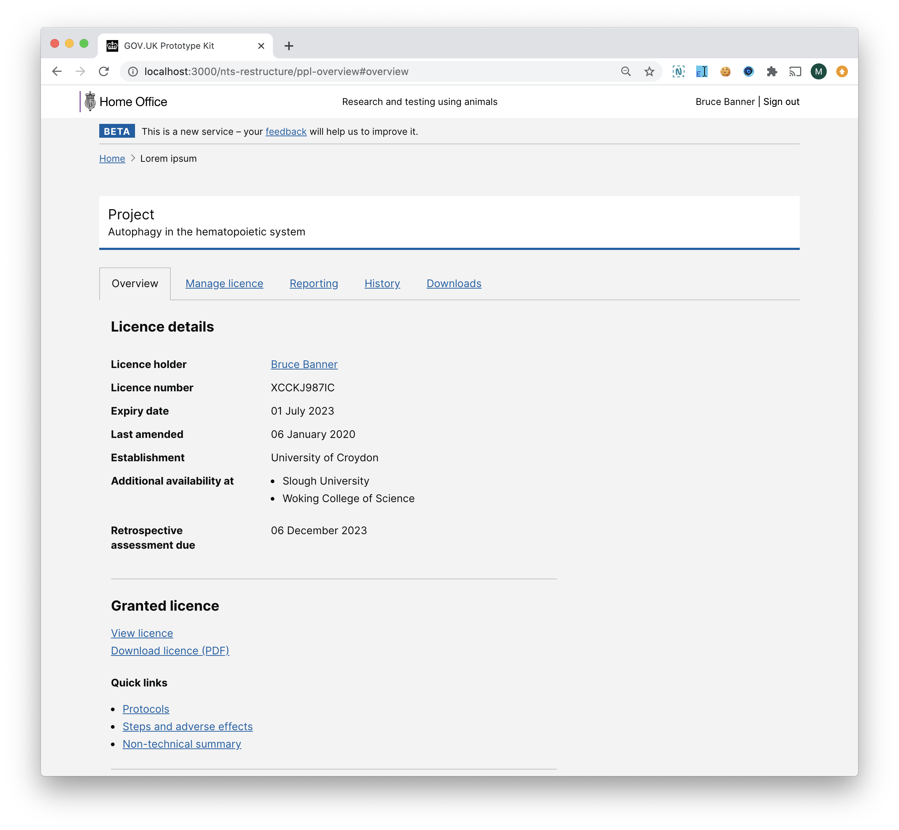

# Summary as of Wednesday 30 September 2020 

# Sprint 68 &#x1f951;

## Just Done
* Summarised findings from NTS restructure and PPL overview research - user research 
* Scheduled two research sessions with establishments and one session with the stats team on returns of procedures - user research
* Redesigned and tested the PPL overview page - design
* Restructured the PPL to move the NTS to the top - design

## About to Do/Doing
* Holding two more research sessions on returns of procedures - user research
* Summarising findings on returns of procedures - user research
* Scheduling sessions with inspectors for testing PPL assessments - user research
* Assessments for amendments - design

## Bugs Fixed this week
The following bugs were fixed this week.
[Bug Fixes week to Wednesday 30 September 2020](graphs/bugs30092020.png)

We planned the following issues in this sprint 
[Sprint 68](graphs/sprint30092020.png)

## Support tickets and known issues
[Link to Support Board](https://collaboration.homeoffice.gov.uk/jira/secure/RapidBoard.jspa?rapidView=1717&selectedIssue=ASSB-253)

[Support board - cached](graphs/supportBoard30092020.png)

## Click here for metrics / progress against plan
[Sprint 68](graphs/progress30092020.png)

[Post Release Roadmap](graphs/roadmap30092020.png)

## These are the goal(s) for the current sprint
1) Test PPL assessments with inspectors - user research and design

## Our goal(s) for the previous sprint were
1. Cat E PIL release candidate - working software ***[Done]***
2. Iterate PPL assesments - design ***[Done]***
3. Complete research on NTS changes to PPL applications - user research ***[Done]***

## Sample Design Prototypes
### Redesigned and tested the PPL overview page

 
### Restructured the PPL to move the NTS to the top

 

## Google Analytics for this report
[Google Analytics](graphs/GA30092020.png)

