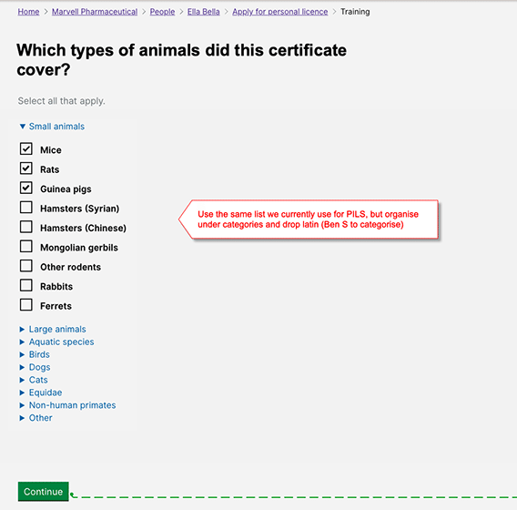

# Summary as of Wednesday 30 October 2019 

# Sprint 45

## Just Done
* Change animal selection for PPL applications 
* Allow change of email addresses for accounts
* Plan further research with ASRU for billing
* Adding comments to printed applications
* Improving how we show completed sections
* Improving the download options

## About to Do/Doing
* Changes to new PPL application and granted licence output as a result of ASRU review
* Plan for HOLTIF meeting
* Planning sessions with establishments for billing

## Bugs Fixed this week
The following bugs were fixed this week.
[Bug Fixes week to Wednesday 30 October 2019](graphs/bugs30102019.png)

We planned the following issues in this sprint 
[Sprint 45](graphs/sprint30102019.png)

## Support tickets and known issues
[Link to Support Board](https://jira.digital.homeoffice.gov.uk/secure/RapidBoard.jspa?rapidView=331&selectedIssue=ALS-47)

[Support board - cached](graphs/supportBoard30102019.jpg)

## Click here for metrics / progress against plan
[Sprint 45](graphs/progress30102019.png)

[Post Release Roadmap](graphs/roadmap30102019.png)

Our goals for the previous sprint were:
1. User Research - explore billing ***\[In progress\]*** 
2. Design - interface and content improvements ***\[Ongoing\]***
3. Allow users to change email address - working sofware ***\[Done\]***

## Sample Design Prototypes

 

 

## Google Analytics for this report
[Google Analytics](graphs/GA30102019.png)

