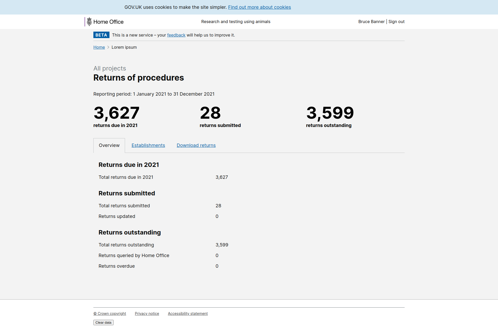

# Summary as of Wednesday 31 March 2021 

# Sprint 81

## Just Done
* TEXT_HERE
* TEXT_HERE
* TEXT_HERE

## About to Do/Doing
* TEXT_HERE
* TEXT_HERE
* TEXT_HERE

## Bugs Fixed this week
The following bugs were fixed this week.
[Bug Fixes week to Wednesday 31 March 2021](graphs/bugs31032021.png)

We planned the following issues in this sprint 
[Sprint 81](graphs/sprint31032021.png)

## Support tickets and known issues
[Link to Support Board](https://collaboration.homeoffice.gov.uk/jira/secure/RapidBoard.jspa?rapidView=1717&selectedIssue=ASSB-253)

[Support board - cached](graphs/supportBoard31032021.png)

## Click here for metrics / progress against plan
[Sprint 81](graphs/progress31032021.png)

[Post Release Roadmap](graphs/roadmap31032021.png)

1. ROPs end-to-end journey - released to production (Narwhal)

1. Download a consolidated RoPs report - working software

## Sample Design Prototypes

 

 

## Google Analytics for this report
[Google Analytics](graphs/GA31032021.png)

