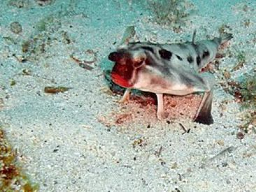

# Summary as of Wednesday 31th July 2024

## Future research and recruitment 

Thank you for your continued involvement in user research – your participation is integral to understanding the user experience on ASPeL. The research on the Named Persons journey continues. Please contact our user researcher rachel.cholerton@digital.homeoffice.gov.uk to participate. thank you.  
 

Please note that the link to the Roadmap is no longer available here.

Completed Sprint 146 (aye-aye)

Attribution:

Fun facts about aye-aye: The aye-aye is believed to be the world's weirdest primate. Although being a primate means that it is related to humans, it looks more like a rodent.

# Completed this Sprint: 146 (aye-aye)
1) We completed the work of tidying up the ASPeL data storehouse to improve deployments for developers.
2) We discovered that the change highlighting did not always display the expected colour changes on the comparison page due to ASPeL misreading the formatting used. 
     a) We applied a fix and correct colour highlighting is now displayed in ASPeL when users have entered single line texts
     b) When users have selected options with radio buttons, such as 'Yes' or 'No'.
     c) And colour changes now display correctlty when users have used check boxes to select options for action plans
3) We applied a fix to make steps' headers in protocols visible to users who reported that headers in steps had been obscured making them invisible. 
4) We completed the analysis of usability testing research for Named Persons
5) We added the NTCO application journey to the prototype of Named Persons
6) The plan for the design of Named Persons work has started.  

   

# Bugs Fixed this Sprint 
[Bug Fixes week to Wednesday 31 July 2024](Bugs310724.jpg.jpg)

# New Sprint: 147(Red-lipped Batfish)

Fun facts about Red-lipped Batfish - native to the Galapagos Islands and Peru, noted for its bright red lips and inability to swim.

## Planned for Sprint 147 (Bat-Fish)

1) Complete features for when users make changes to steps in protocols. 
2) Complete improvements to the user experience in ASPeL, when selecting options for the fate of animals being kept alive after they have been used in procedures.
3) Continue work on ITHC remediations. 
4) Continue work on Accessibility milestones for ASPeL. 
5) Start work on Named Persons' MVP. 
6) Complete desk research on PPL work related to plans for the .gov.uk content work. 
7) Decide where the first iteration of the guides will be hosted.
8) Design PIL-E solution for course date alignment only.
9) Agree on the next Named Person design iteration.

   

## Things to bear in mind
Kindly let us know how we are doing in keeping you informed. We appreciate your feedback on the content of this report.

# Work in progress
1) Improvements to the user experience in ASPeL, when selecting options for the fate of animals being kept alive after they have been used in procedures.
  

   
 
   
## Support tickets and known issues
[Link to Support Board](https://collaboration.homeoffice.gov.uk/jira/secure/RapidBoard.jspa?rapidView=1717)
