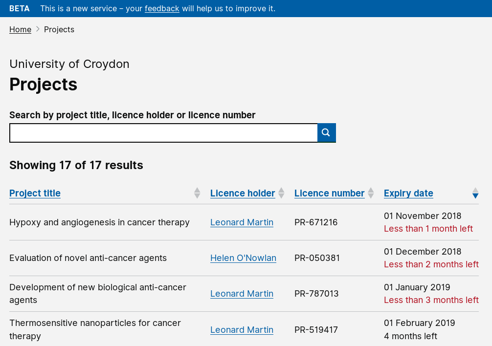
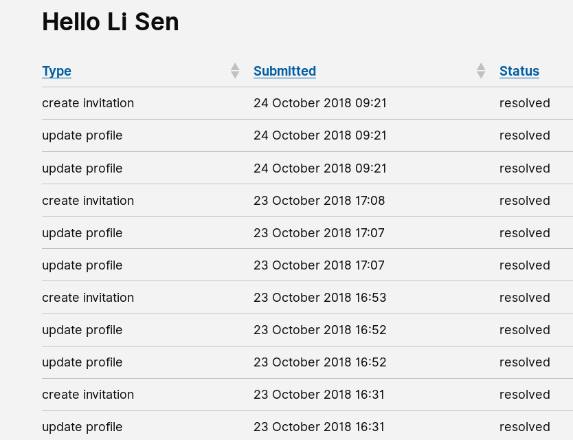

# Summary as of 31st October 2018 

# Sprint 20

## Just Done
* Iterated designs for PPL applications(Protcols section) and tested with user (Inspectors and Establishment)
* Created a pre production environment (permitting stable environment for demonstrations and testing)
* Prepared for and engaged in service assessment

## About to Do/Doing
* Prepare designs for user research for PPL application (3Rs section)
* Prepare for user research using PPL application (3Rs section)
* Develop working software to allow NTCO endorsement of PIL application

## Things to be aware of
* We have picked up the first transfer of data from the current suppliers
* The second alpha service assessment was conducted yesterday - Tuesday 30th October  

## Click here for our High-Level Road map
[Link to Live Road map in Trello](https://trello.com/b/gDQdE01u/asl-roadmap)    [\(Cached Image\)](graphs/ASLRoadMap31102018.jpg)

## Click here for metrics / progress against plan
[RRRWEEK_SPRINT_RELEASE](graphs/progress31102018.png)

## Burnup Chart

[Burnup Chart](burnup31102018.md)

## Risks
[Links to Project Risks in Trello](https://trello.com/b/VuFuCL7t/risk-register-and-kpis-asl-delivery)    [\(Cached Image\)](graphs/ASLRiskRegister31102018.jpg)

[Risk Management Chart](graphs/risk31102018.png)

## Sprint Planning
* We planned the following issues in sprint planning today [Link to Issues in Jira](https://jira.digital.homeoffice.gov.uk/secure/RapidBoard.jspa?rapidView=261)    [\(Cached Image\)](graphs/sprint31102018.png)

Our goals for the previous sprint were:
1. Address Tech debt from PIL development
*Goal Completed*
2. Prepare for service assessment
*Goal Completed*
3. Continue to Iterate and Validate PPL prototypes
*Goal Completed*

Our goals for the sprint are:
1. Demonstrate working software NTCO endorsement of PIL 
2. Design 3Rs for User Research 
3. Look at the Data

## Sample Working Software
### External Users

#### Logins:
`holc`, `read`, `basic`

(in each case the username and password are the same)
### Internal Users

#### Logins:
`licensing`, `inspector`

(in each case the username and password are the same)

PLEASE NOTE:
The software available on this link is work in progress. Sometimes when it's accessed changes will be being made that may mean it behaves strangely, or doesn't work at all. If you see something that doesn't look right, please try logging out and logging in again.  If that doesn't work, of you have any questions, please feel free to report what you see via [animalscience@digital.homeoffice.gov.uk](animalscience@digital.homeoffice.gov.uk).
